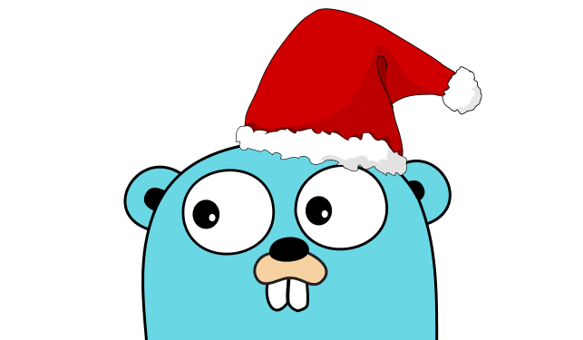

# 🎄 Advent of Code 2015

Solutions for [Advent of Code 2015](https://adventofcode.com/2015) in [Go](https://go.dev/). 

Template heavily inspired by [https://github.com/fspoettel/advent-of-code-rust](https://github.com/fspoettel/advent-of-code-rust). 

--- 

## Environment Setup 💻 

1. Ensure you have installed: 
    - [VSCode](https://go.microsoft.com/fwlink/?linkid=830387)
    - [Docker](https://www.docker.com/) (and enabled). 

2. Install the VSCode extension [Dev Containers](https://marketplace.visualstudio.com/items?itemName=ms-vscode-remote.remote-containers). 

3. Open VSCode inside the repo and select the green icon in the bottom-left corner. 

    

4. Select `Reopen in Container` to download and/or open a Golang development container in VSCode. 

    


## Usage 🔨 

```golang
// example: go run main.go 1 both ./inputs/input-01.txt
go run main.go <day-number> <p1|p2|both> <file-path-input>

// output:
// ----------
// | Day 01 |
// ----------
//
// 🎄 Part 1 🎄
// 6 (elapsed: 37.03µs)
//
// 🎄 Part 2 🎄
// 9 (elapsed: 33.18µs)
```
